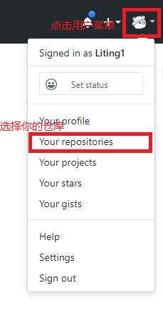
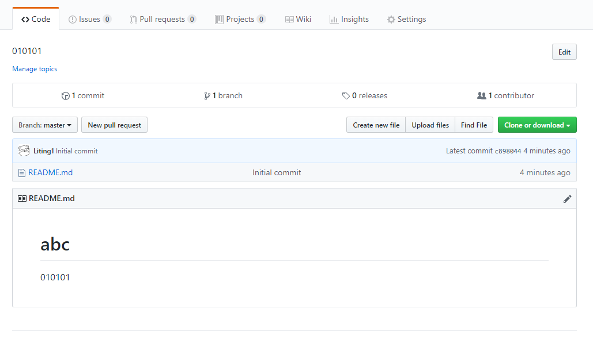
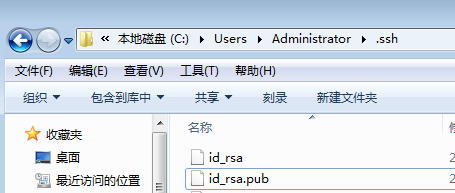
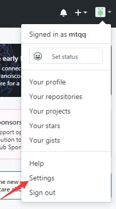
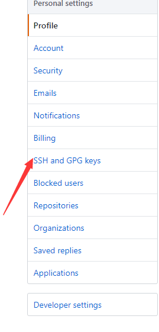
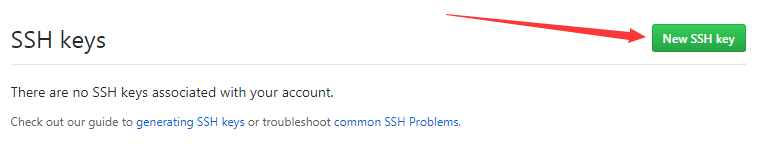

# git 入门

## git客户端下载

[下载地址](https://git-scm.com/downloads) 选择你对应的系统版本，傻瓜式安装(一直点下一步就行)

## 注册github账号

[注册地址](https://github.com/) 注册一个账号，这个账号以后会经常使用，不要忘记密码了


### git客户命令的使用

#### 第一次使用之前配置用户信息

```
	git config --global user.name "你的用户名"
	git config --global user.email 你的邮箱地址
```

> 说明： git config 为配置的命令，--global 为全局配置 配置的选项 配置的值

+ 配置完成之后使用 `git config --list`命令查看配置信息

+ 如果配置是配置字段打错字了可以使用`git config --global --unset 对应添加的字段名` 来删除对应的字段


#### github 创建远程仓库

1. 注册完成之后登陆github



2. 点击 NEW 创建一个新的仓库


3. 创建仓库的简单配置


4. 创建完毕


#### 本地仓库的创建

+ 在电脑上新建一个文件夹，在文件中鼠标右键选择Git Bash here

+ git init
	- 创建一个空的Git存储库或重新初始化现有存储库
	- 会在项目目录下创建一个隐藏的 .git文件

+ git add . 将文件内容添加到索引中(跟踪当前目录下文件)
	- 常用的选项 . 表示将此目录下的所有文件添加到索引中
	- 后面使用目录下的 完整路径及文件名 表示添加单个索引文件

+ git status 
	- 显示工作树状态

+ git commit -m '更改说明'  
	- 记录对存储库的更改(将暂存区里的改动给提交到本地的版本库)

+ git remote -v 
	- 查看关联的远程仓库的详细信息

+ git remote add origin 地址
	- 添加远程仓库的关联

+ git remote remove 远程仓库的名字
	- 删除远程仓库的关联

+ git diff
	- 显示当前版本和上一个版本修改的内容

+ git log
	- 可以查看提交的历史记录，以便要回退到哪个版本

+ git log --pretty=oneline
	- 修改显示历史记录的格式

+ git reflog
	- 查看命令历史，以便要确定回到未来的哪个版本

+ git reset --hard "指定版本的commit id"
	- 调整到指定的版本去

+ git reset --hard HEAD^
	- 回到上一个版本

+ git reset --merge
	- 回退到 git pull 冲突之前的版本
+ git branch
	- 查看本地分支

+ git branch 分支名称
	- 创建本地分支

+ git checkout 分支名称
	- 切换的指定的分支

+ git merge 分支的名称
	- 合并分支
	- 在需要合并目标分支之前先切换到需要合并的分支上

+ git clone 需要克隆的项目地址
	- 将存储库克隆到新目录中

+ git pull
	- 默认是使远程的主分支与当前所在分支合并

+ git pull origin next:master
	- 使远程的next分支与本地的主分支进行合并

+ git pull origin next
	- 使远程的next分支与当前所在的分支进行合并

+ git push origin master
	- 将本地的master分支推送到远程的master分支上，如果远程分支不存在则会创建远程

+ git push origin --delete master 
	- 将远程的 master 分支删除

+ git push -u origin master 
	-将本地的master分支推送到远程的master分支，同时设置默认的主机origin，以后git push时就不用加参数了


#### 在本地创建ssh key

1. 在git 客户端输入命令
	+ ssh-keygen -t rsa -C
	- 生成本地 SSH 密钥
	- 然后一直回车使用默认值
	- 最后就会在 `C:\Users\Administrator\.ssh` 路径下看到如下两个文件
	;

2. 用记事本打开id_rsa.pub 文件,复制其中的内容


3. 回到GitHub网站 点击设置

	

4. 选择 SSH and GPG keys
	
	

5. 新创建一个SSH key

	

6. 把之前的id_rsa.pub文件中复制的内容粘贴到 key 里面,title 可以随意填写
	
	

7. 以后提交远程仓库就不需要输入密码。而且还可以使用 ssh 方式克隆远程地址


#### git 常用命令

1. git clone 'github路径'  ==> 克隆GitHub上的一个项目
2. git init ==> 把当前目录变成Git可以管理的仓库
3. git add "文件名"/ .  ==> 需要添加到仓库的文件 / 如果是一个点那么久代表添加所有文件
4. git commit -m "提交文件的描述信息" ==> 把文件提交到仓库
5. git log ==> 可以查看提交的历史记录，以便要回退到哪个版本
6. git log --pretty=oneline ==> 修改显示历史记录的格式
7. git reflog ==> 查看命令历史，以便要确定回到未来的哪个版本
8. cat "文件名" ==> 浏览对应得文件
9. git reset --hard "指定版本的commit id" ==> 调整到指定的版本去
10. git reset --hard HEAD^ ==> 回到上一个版本
11. git status ==> 查看仓库的当前状态
12. git diff ==> 显示当前版本和上一个版本修改的内容
13. git mv old文件名 new文件名  ==> 修改指定的文件名

14. git remote add origin '你的远程库地址' ==> 光联到远程库
15. git pull --rebase origin master ==> 获取远程库于本地同步合并
16. git push -u origin master ==> 把本地库的内容推送到远程

